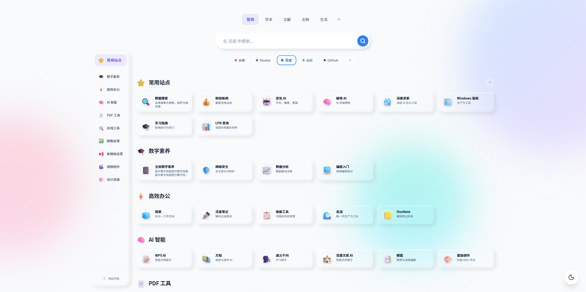
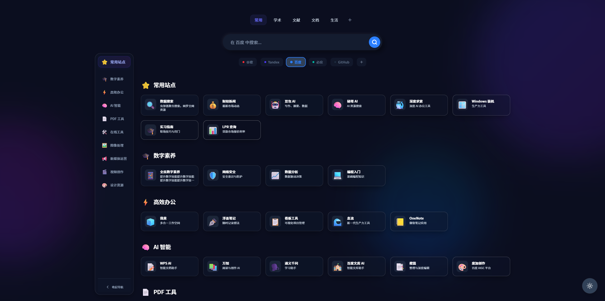
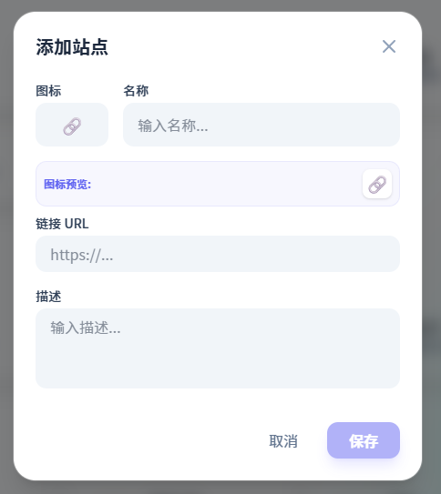
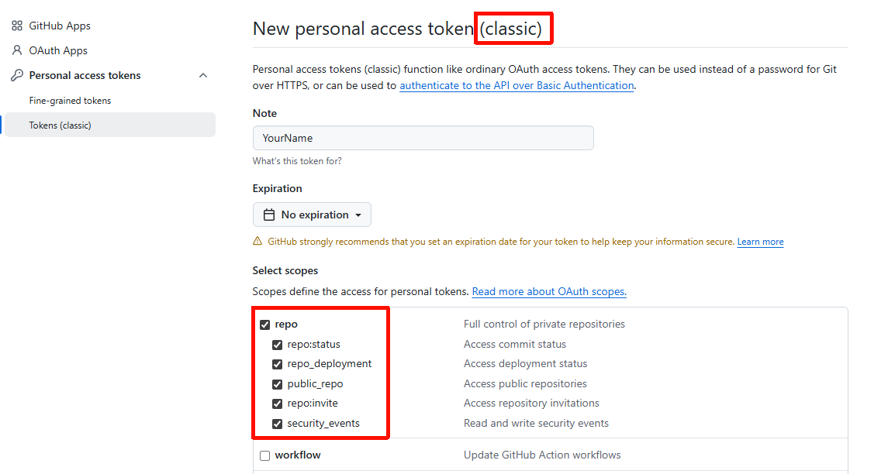

# MyNav - 高颜值自部署极简导航页


MyNav 是一个专为个人打造的高颜值、极简、生产力导向的导航页面。它不仅拥有精致的 UI 设计和流畅的交互，更实现了网页端修改直接同步至本地源码的创新体验。

> 这个项目是纯 AI 辅助开发的，我使用了 [Stitch](https://stitch.withgoogle.com/) 和 [Antigravity](https://antigravity.google/)。整个过程非常丝滑，AI 真的可以！教程视频参考的是 B 站 UP 主 [陶渊xiao明](https://space.bilibili.com/258944527/) 的视频：[APP 从 0 → 上线发布！免费 Vibe Coding 流程：Stitch + AI Studio + Antigravity！](https://www.bilibili.com/video/BV1DaruB2ELU/)

## ✨ 核心特性

- **💎 精致视觉**：
  - 基于 TailwindCSS 4 构建，支持**高阶玻璃质感 (Glassmorphism)** 视觉风格。
  - **深度黑暗模式**：定制级明暗切换效果，针对暗色环境深度优化。
  - **动态壁纸感**：背景包含丝滑的浮动渐变 light-ball 动画。




- **🚀 生产力增强**：
  - **多引擎搜索**：集成百度、谷歌、必应等多种引擎，支持自定义添加和快速切换。
  - **搜索建议**：实时获取主流引擎的搜索关键词补全。

- **动态管理与同步**：
  - **拖拽排序 (DnD)**：基于 `@dnd-kit` 实现，支持全站点的可视化拖拽布局。
  - **全方位 CRUD**：直接在网页上增删改分类和站点卡片，无需手动编辑代码。
  - **🔥 源码/隐私双栖同步**：
    - **本地开发**：改动自动同步至 `src/constants.ts`。
    - **在线部署**：支持将数据存入**另一个私有仓库**的 `nav-data.json` 中，实现代码公开、数据隐私。



## 🛠️ 技术栈

- **前端框架**: React 19 (Hooks)
- **构建工具**: Vite 7
- **样式方案**: TailwindCSS 4 (新一代引擎)
- **图标库**: Lucide React + Emoji
- **拖拽库**: @dnd-kit
- **开发桥接**: 自定义 Vite 中间件实现文件系统操作

## 📦 快速启动

1. **克隆项目**
   ```bash
   git clone https://github.com/mkbkakwk/MyNav.git
   cd MyNav
   ```

2. **安装依赖**
   ```bash
   pnpm install
   ```

3. **启动开发服务器**
   ```bash
   pnpm run dev
   ```

4. **开始使用**
   打开浏览器访问 `http://localhost:5173`。在页面上右键点击任何组件即可进入编辑模式。

## ⚙️ 配置文件

所有的初始数据和导出数据都保存在 `src/constants.ts` 中。由于内置了同步插件，你在 UI 上的修改会实时写回此文件。

```typescript
// src/constants.ts 示例
export const SECTIONS: SectionData[] = [
  {
    id: "fav",
    title: "常用站点",
    icon: "⭐",
    items: [ ... ]
  }
];
```

## 🔐 GitHub 隐私云同步配置

为了在公开代码的同时保护你的个人收藏，我们建议采用“隐私隔离”模式：

1. **生成 GitHub Token**: 在 GitHub [Personal Access Tokens](https://github.com/settings/tokens) 页面生成一个具有 `repo` 权限的 Token。
2. **新建隐私仓库**: 建议新建一个专门存放数据的**私有仓库**（如 `my-nav-data`）。
3. **网页端配置**:
   - 点击网页右下角的**设置齿轮**。
   - 输入你的 Token、GitHub 用户名以及刚才新建的**私有仓库名**。
   - 开启“在线同步已激活”开关。
4. **生效**: 之后你在网页上的任何修改都会自动以 commit 形式存入私有仓库的 `nav-data.json` 中，并在几分钟后自动部署更新你的在线站点。

> [!IMPORTANT]
> **生成 Token 的关键步骤**：
> 1. 访问 GitHub [Tokens (classic)](https://github.com/settings/tokens) 页面。
> 2. 点击 `Generate new token (classic)`。
> 3. **必须勾选 `repo` 权限**（这是最重要的一步，否则同步会失败）。
> 4. 生成后立即复制 Token，因为它只会显示一次。



## 📊 数据初始化 (代码与数据分离)

如果你 Fork 了本项目并希望开启隐私同步，请按以下步骤初始化你的私有数据：

1. **获取模板**: 直接复制本项目根目录下的 `nav-data.json` 文件。这是我们为您预设的模板数据。
2. **上传私仓**: 将该文件上传到你新建的**私有仓库**根目录。
3. **开启同步**: 参照上方“GitHub 隐私云同步配置接口”完成设置（配置你的私仓 Token 和仓库名）。
4. **验证**: 刷新页面，此时网页将停止从源码读取示例数据，转而加载并管理你私有仓库中的真实数据。

---

## 🚀 自动化部署说明

本项目已内置 GitHub Actions 工作流。当你推送代码到 `main` 分支时，系统会自动执行：
- 环境安装与依赖构建。
- 静态资源打包（Build）。
- 自动发布到该仓库名下的 GitHub Pages。

> [!TIP]
> 部署后，请确保在仓库的 **Settings -> Pages -> Build and deployment -> Source** 中选择 **GitHub Actions**。选择该项后，无需点击下方的任何 `Configure` 按钮（如 Static HTML 或 Jekyll），系统会自动识别并运行项目中的 `.github/workflows/deploy.yml` 脚本。

可以直接在仓库顶部的 **Actions** 标签页查看部署进度。

> [!NOTE]
> 如果你也布置了这个项目，你的访问地址通常为：`https://<你的用户名>.github.io/MyNav/`

欢迎通过 Issue 或 Pull Request 为 MyNav 贡献更多精美的配色方案或功能特性。

## 📄 开源协议

MIT
