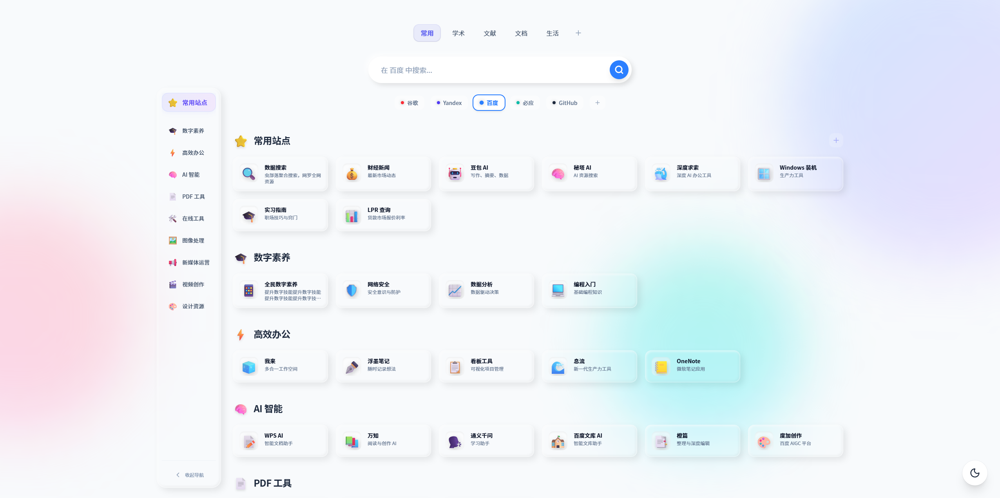
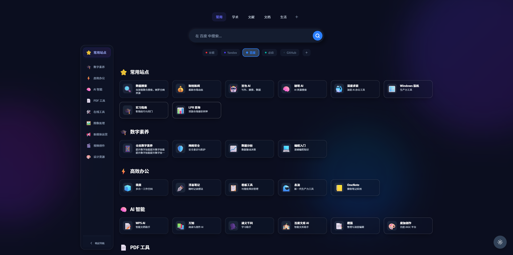
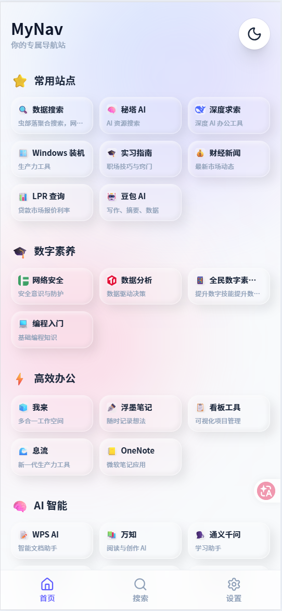
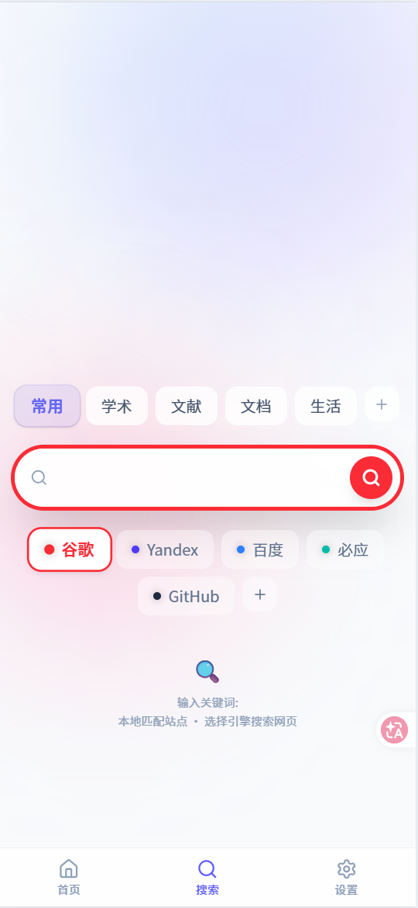
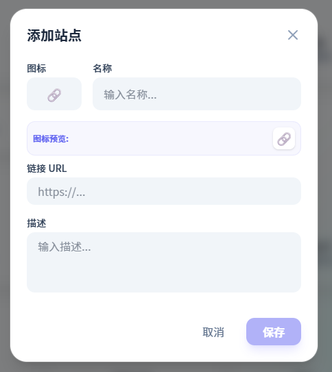
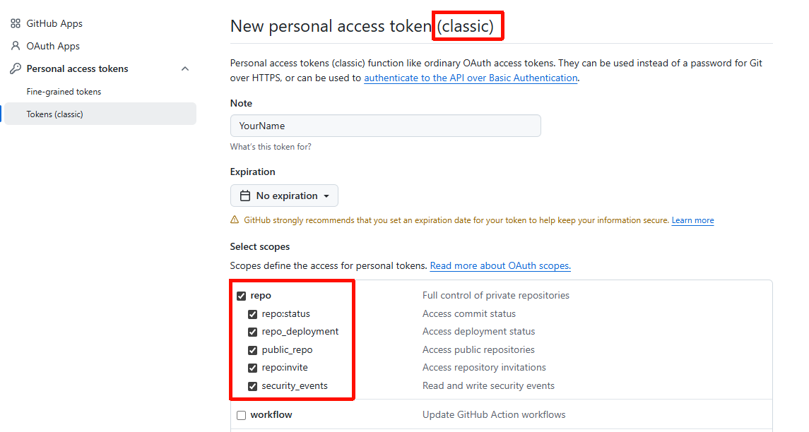

# MyNav - 高颜值自部署极简导航页


MyNav 是一个专为个人打造的高颜值、极简、生产力导向的导航页面。**桌面端与移动端各有独立的专属界面**:桌面是精致的三栏玻璃拟态布局,移动端是原生 App 式体验(底部 Tab、全屏搜索、长按管理),同一份数据,双端自动同步。

> 这个项目是纯 AI 辅助开发的,我使用了 [Stitch](https://stitch.withgoogle.com/) 和 [Antigravity](https://antigravity.google/)。教程视频参考的是 B 站 UP 主 [陶渊xiao明](https://space.bilibili.com/258944527/) 的视频:[APP 从 0 → 上线发布!免费 Vibe Coding 流程:Stitch + AI Studio + Antigravity!](https://www.bilibili.com/video/BV1DaruB2ELU/)

## ✨ 核心特性

### 💎 精致视觉
- 基于 TailwindCSS 4 构建,支持**高阶玻璃质感 (Glassmorphism)** 视觉风格
- **深度黑暗模式**:定制级明暗切换效果,针对暗色环境深度优化
- **动态壁纸感**:背景包含丝滑的浮动渐变 light-ball 动画

<div align="center">
  
  
</div>

<div align="center">
  
  
</div>

### 📱 双端独立界面
- **桌面端**:侧边栏导航 + 顶部多引擎搜索 + 分区卡片网格,窗口宽度自适应列数
- **移动端**(按 UA 自动切换):App 式体验
  - 底部 Tab 栏(首页 / 搜索 / 设置),横屏自动收缩为悬浮胶囊
  - **搜索页**:搜索栏精确居中,分类 + 搜索引擎两级切换(各带品牌色),实时搜索建议
  - **首页**:紧凑卡片网格,列数随屏幕宽度自适应;长按卡片/分区标题弹出操作菜单
  - 全部数据管理与桌面共用,增删改即时同步

### 🚀 生产力增强
- **多引擎搜索**:集成百度、谷歌、必应等引擎,支持分类分组、自定义添加和快速切换
- **搜索建议**:实时获取主流引擎的搜索关键词补全
- **桌面 Ctrl+K 命令面板**:一键唤起站内搜索,实时过滤本地站点,支持 `↑↓` 选择、`Enter` 打开
- **点击统计排序**:自动记录卡片点击次数,一键切换「默认 / 常用优先 / 最近使用」排序(桌面与移动端同步)

### 🔍 智能元数据抓取
- 新增站点时输入 URL 自动获取标题、描述、图标(五层降级链路:Microlink → Jina Reader → 多代理抓取 HTML → oEmbed/RSS 结构化端点 → 域名图标兜底)
- **分层持久缓存**:完整信息缓存 7 天、仅图标缓存 1 小时、失败不缓存,大幅降低第三方 API 请求量

### 动态管理与同步
- **全方位 CRUD**:直接在网页上增删改分类和站点卡片,无需手动编辑代码(移动端长按呼出操作菜单)
- **拖拽排序 (DnD)**:基于 `@dnd-kit` 实现桌面端可视化拖拽布局
- **点击统计**:使用频率与最近访问记录在案,`stats` 字段随云数据同步,多设备排序依据一致
- **同步状态可视化**:桌面悬浮组 / 移动端首页标题栏状态圆点——绿(已同步)/ 黄(同步中)/ 红(失败,点击重试),显示上次同步时间,失败原因不再静默
- **🔥 源码/隐私双栖同步**:
  - **本地开发**:改动自动同步至 `src/constants.ts`
  - **在线部署**:支持将数据存入**另一个私有仓库**的 `nav-data.json`,实现代码公开、数据隐私
  - **首次开启保护**:开启云同步时询问"立即拉取远程 / 保留本地",未授权前不会上传,防止本地数据静默覆盖远程



## 🛠️ 技术栈

- **前端框架**: React 19 (Hooks)
- **构建工具**: Vite 7
- **样式方案**: TailwindCSS 4 (新一代引擎)
- **动画**: framer-motion(搜索建议 spring 动画、卡片交互)
- **图标库**: Lucide React + Emoji
- **拖拽库**: @dnd-kit
- **开发桥接**: 自定义 Vite 中间件实现文件系统操作

## 📦 快速启动

```bash
git clone https://github.com/mkbkakwk/MyNav.git
cd MyNav
pnpm install
pnpm run dev    # http://localhost:5173
```

- 桌面端:直接访问,窗口宽度自适应
- 移动端:手机浏览器访问同一地址(自动识别),或用 Chrome DevTools 设备模拟(需在模拟面板切换 UA 为手机)

## ⚙️ 配置文件

所有的初始数据和导出数据都保存在 `src/constants.ts` 中。由于内置了同步插件,你在 UI 上的修改会实时写回此文件。

```typescript
// src/constants.ts 示例
export const SECTIONS: SectionData[] = [
  {
    id: "fav",
    title: "常用站点",
    icon: "⭐",
    items: [ ... ]
  }
];
```

## 🔐 GitHub 隐私云同步配置

为了在公开代码的同时保护你的个人收藏,我们建议采用"隐私隔离"模式:

1. **生成 GitHub Token**: 在 GitHub [Personal Access Tokens](https://github.com/settings/tokens) 页面生成一个具有 `repo` 权限的 Token。
2. **新建隐私仓库**: 建议新建一个专门存放数据的**私有仓库**(如 `my-nav-data`)。
3. **网页端配置**:
   - 点击网页右下角的**设置齿轮**(移动端:底部 Tab → 设置)。
   - 输入你的 Token、GitHub 用户名以及刚才的**私有仓库名**。
   - 开启"在线同步已激活"开关。
4. **首次开启会询问**: "立即拉取远程数据" 或 "保留本地数据"——选择拉取会用远程数据接管本页;未授权前任何修改都不会上传,避免覆盖你在其他设备上的数据。
5. **生效**: 之后你在网页上的任何修改都会自动以 commit 形式存入私有仓库的 `nav-data.json` 中,并在几分钟后自动部署更新你的在线站点。

> [!IMPORTANT]
> **生成 Token 的关键步骤**:
> 1. 访问 GitHub [Tokens (classic)](https://github.com/settings/tokens) 页面。
> 2. 点击 `Generate new token (classic)`。
> 3. **必须勾选 `repo` 权限**(这是最重要的一步,否则同步会失败)。
> 4. 生成后立即复制 Token,因为它只会显示一次。



## 📊 数据初始化 (代码与数据分离)

如果你 Fork 了本项目并希望开启隐私同步,请按以下步骤初始化你的私有数据:

1. **获取模板**: 直接复制本项目根目录下的 `nav-data.json` 文件。
2. **上传私仓**: 将该文件上传到你新建的**私有仓库**根目录。
3. **开启同步**: 参照上方"GitHub 隐私云同步配置"完成设置。
4. **验证**: 刷新页面,此时网页将停止从源码读取示例数据,转而加载并管理你私有仓库中的真实数据。

---

## 🚀 自动化部署说明

本项目已内置 GitHub Actions 工作流。当你推送代码到 `main` 分支时,系统会自动执行:
- 环境安装与依赖构建。
- 静态资源打包(Build)。
- 自动发布到该仓库名下的 GitHub Pages。

> [!TIP]
> 部署后,请确保在仓库的 **Settings -> Pages -> Build and deployment -> Source** 中选择 **GitHub Actions**。

> [!NOTE]
> 访问地址通常为:`https://<你的用户名>.github.io/MyNav/`

## 📄 开源协议

MIT
